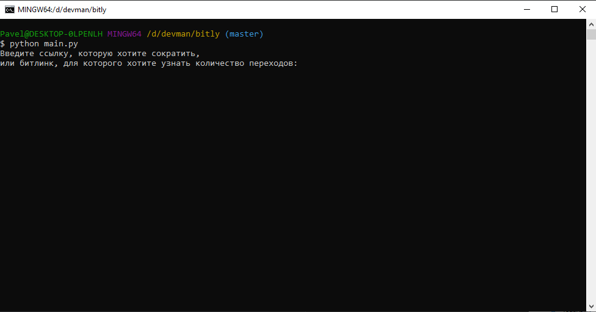
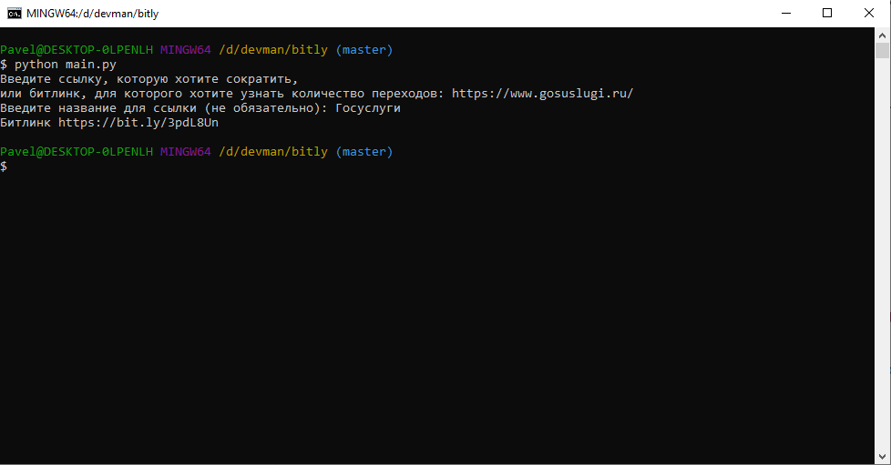
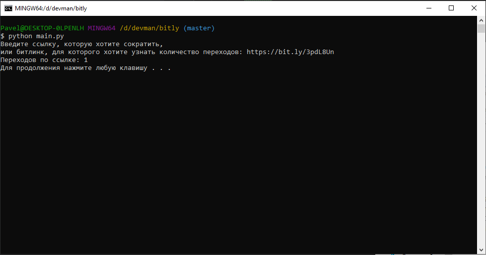

# Программа для сокращения ссылок

---

Скрипт позволяет сократить ссылку и получить "битлинк", а также  предоставляет возможность узнать количество переходов по битлинку.

## Установка зависимостей
Первым делом, скачайте код:
``` 
git clone https://github.com/pas-zhukov/bitly.git
```
Для работы скрипта понадобятся библиотеки, перечисленные в `reqirements.txt`.
Их можно установить при помощи pip:
```
pip install -r requirements.txt
```
Проверить, что все необходимые библиотеки на месте:
``` 
pip list
```

## Получение токена

Для работы скрипта нужен токен Bitly. Чтобы его получить:
1. Регистрируемся на [bitly.com](https://bitly.com/).
2. Генерируем токен в [разделе настроек](https://bitly.com/a/oauth_apps).
3. Сохраняем.

## Запуск

1. В корне с программой создаём файл `.env` со следующим содержимым:
```
BITLY_TOKEN=<Ваш токен>
```
2. Запускаем скрипт командой:
```
python main.py
```
3. Если всё было сделано правильно, программа предложит ввести ссылку:




Если ввести длинную ссылку, программа создаст битлинк:




Если ввести битлинк, программа покажет число переходов по нему:




## Цели проекта

Код написан в учебных целях — это урок на курсе по Python и веб-разработке на сайте Devman.